# POC

## Target

Pod is authenticated with Azure Entra ID could add a row into table `students` in customer-created database named `testing123`

**Prerequisite**: Main initial Azure/Microsoft account

## Implementation

### 1. Code base

**Go to main project**

cd `java-postgres-wi-app`

Build & Push Docker Image

- Registry: docker.io (Docker Hub)
- Repo: darkhero101

`docker build --no-cache -t docker.io/darkhero101/java-postgres-wi-service:14.0.0 .`

`docker push  docker.io/darkhero101/java-postgres-wi-service:14.0.0`

### 2. Azure Portal

Create PostgreSQL Flexible Server

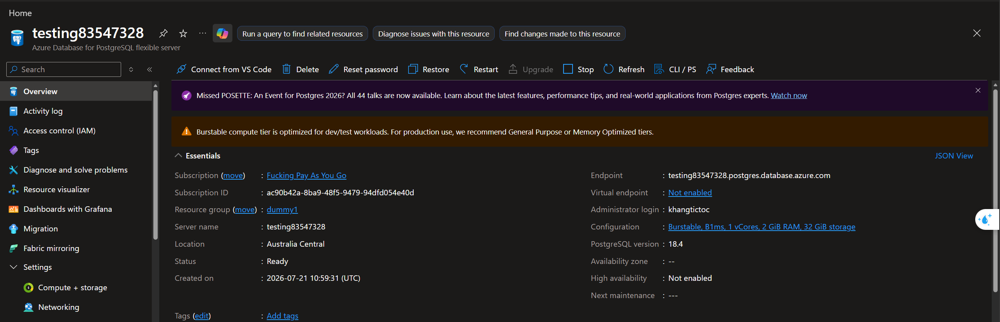

- Noticable settings
  - Enable All network Firewall (For testing)
  - 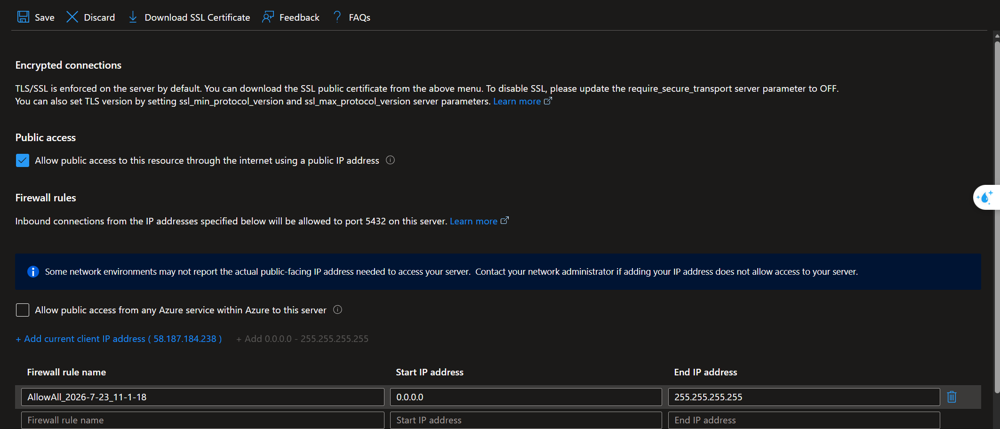
  - Enable Authentication for both Entra ID (must-have) and local account (for testing)
  - 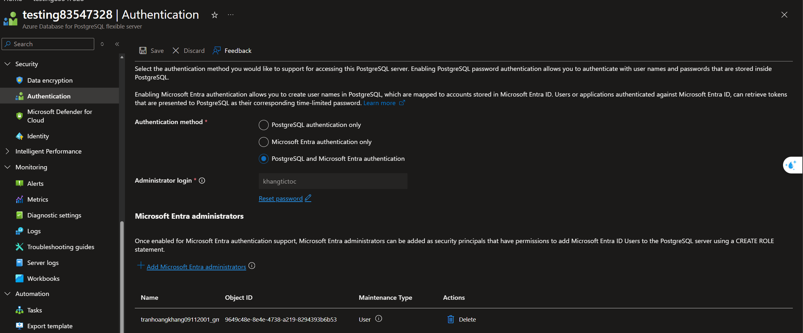

Config JSON (Verified)

```json
{
  "apiVersion": "2025-08-01",
  "id": "/subscriptions/ac90b42a-8ba9-48f5-9479-94dfd054e40d/resourceGroups/dummy1/providers/Microsoft.DBforPostgreSQL/flexibleServers/testing83547328",
  "name": "testing83547328",
  "type": "microsoft.dbforpostgresql/flexibleservers",
  "sku": {
    "name": "Standard_B1ms",
    "tier": "Burstable"
  },
  "location": "australiacentral",
  "tags": {},
  "properties": {
    "replica": {
      "role": "Primary",
      "capacity": 5
    },
    "storage": {
      "type": "Premium_LRS",
      "iops": 120,
      "tier": "P4",
      "storageSizeGB": 32,
      "autoGrow": "Disabled"
    },
    "network": {
      "publicNetworkAccess": "Enabled"
    },
    "privateEndpointConnections": [],
    "dataEncryption": {
      "type": "SystemManaged"
    },
    "authConfig": {
      "activeDirectoryAuth": "Enabled",
      "passwordAuth": "Enabled",
      "tenantId": "4226c1de-24e6-4d6f-b050-b14a85140192"
    },
    "fullyQualifiedDomainName": "testing83547328.postgres.database.azure.com",
    "version": "18",
    "minorVersion": "4",
    "administratorLogin": "khangtictoc",
    "state": "Ready",
    "backup": {
      "backupRetentionDays": 7,
      "geoRedundantBackup": "Disabled",
      "earliestRestoreDate": "2026-07-21T11:05:50.5938697Z"
    },
    "highAvailability": {
      "mode": "Disabled",
      "state": "NotEnabled"
    },
    "maintenanceWindow": {
      "customWindow": "Disabled",
      "dayOfWeek": 0,
      "startHour": 0,
      "startMinute": 0
    },
    "replicationRole": "Primary",
    "replicaCapacity": 5
  },
  "systemData": {
    "createdAt": "2026-07-21T10:59:31.8595739Z"
  }
}
```

### 3. Database Setup

Create Managed Identity for Service (Pod) to consume

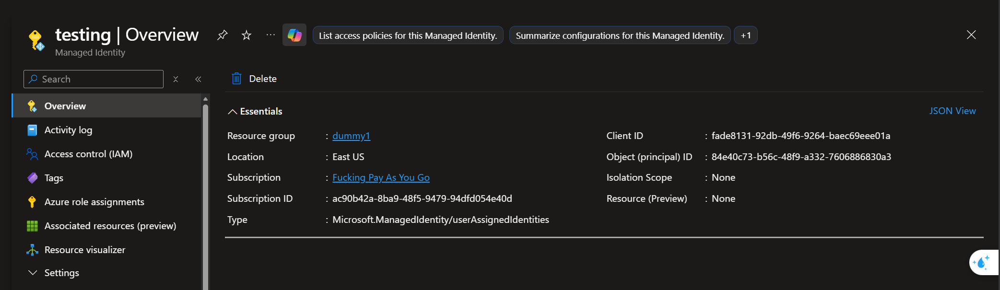

Create a aad federated service principal with above Managed Identity

1. Login into Postgres Server with main Azure account

```bash
az login --use-device-code
```

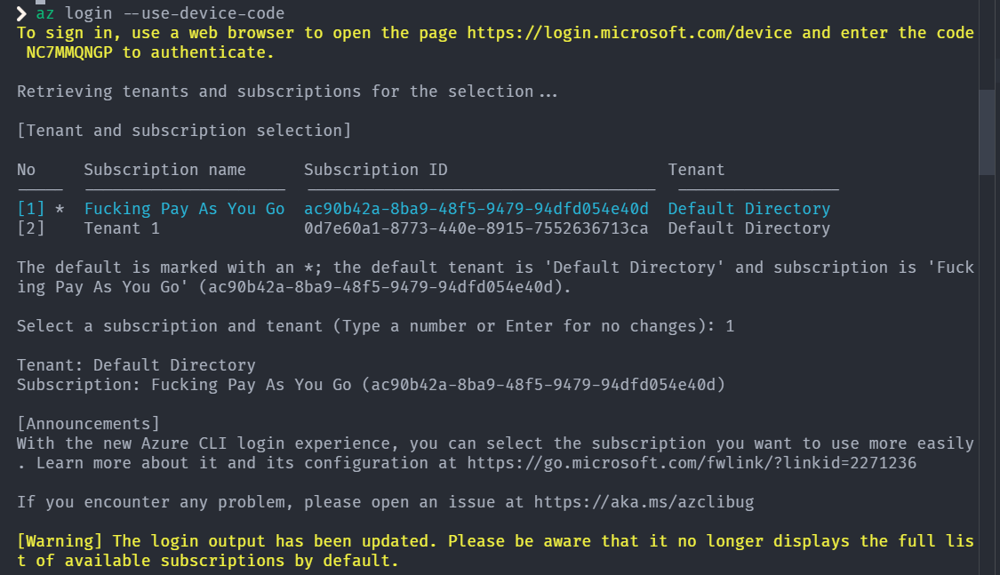

2. Get access token

```bash
az account get-access-token --resource-type oss-rdbms --query accessToken -o tsv
```

Key specs:

- Host: testing83547328.postgres.database.azure.com
- Port: 5432
- Default DB name: postgres
- User: tranhoangkhang09112001_gmail.com#EXT#@tranhoangkhang09112001gma (Get the name in Entra ID user in "Authentication" tab)

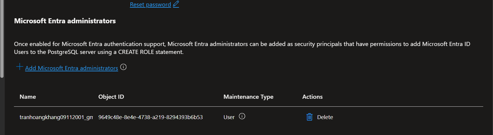

```bash
PGPASSWORD="<ACCESS_TOKEN_ABOVE>" psql "host=testing83547328.postgres.database.azure.com port=5432 dbname=postgres user=tranhoangkhang09112001_gmail.com sslmode=require"
```

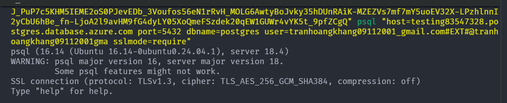

Confirm current logged-in user

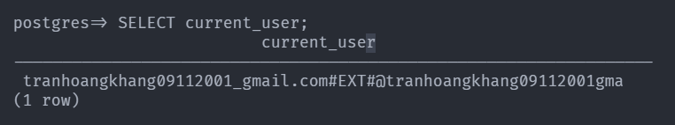

---

**Initiate data**

```sql
CREATE DATABASE testing123;
\c testing123

CREATE TABLE students (
  student_id VARCHAR(64) PRIMARY KEY,
  student_name TEXT NOT NULL,
  student_age INT,
  student_major TEXT,
  created_at TIMESTAMPTZ NOT NULL DEFAULT CURRENT_TIMESTAMP
);
```

---

Create AAD federated service principal with above Managed Identity

```sql
SELECT * FROM pgaadauth_create_principal_with_oid(
    '<identity-name>',
    '<identity-object-id>',
    'service',
    false,
    false
```

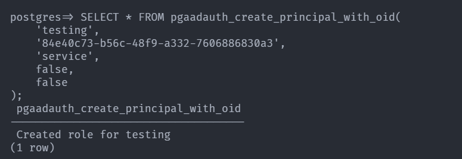

Grant permission to target `testing123` table and `public` table

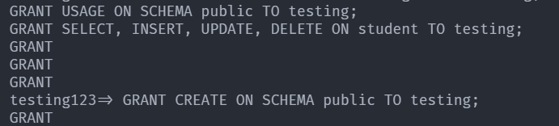

### 4. Deploy

```bash
cd azure-workload-identity-postgres-app
```

```bash
kubectl create namespace testing
kubectl apply -f . -n testing
```

Verify running service, add a row then auto restarted

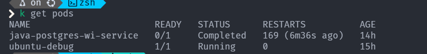

Verify logs

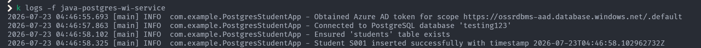

Verify data

```sql
SELECT * FROM students;
```

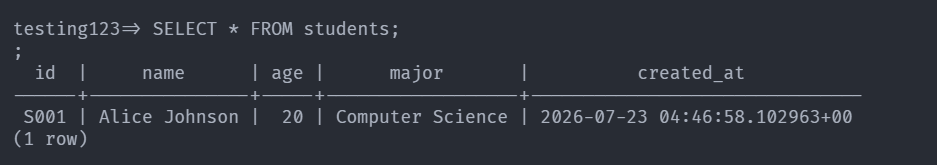

Official Docs: [Connect with managed identity in Azure Database for PostgreSQL flexible server](https://learn.microsoft.com/en-us/azure/postgresql/security/security-connect-with-managed-identity)
